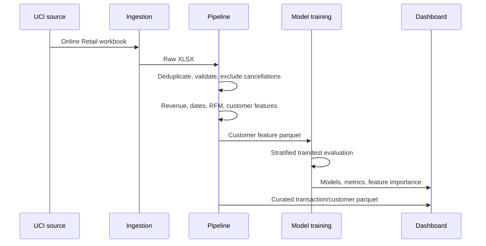
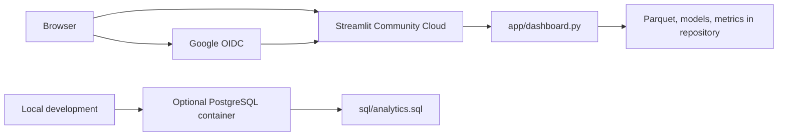

# MadeIT Insights Architecture

## Purpose

MadeIT Insights is a single-repository analytics application that separates the reproducible data pipeline from the presentation layer. Its design prioritizes traceable metrics: every dashboard value is derived from processed transaction data or a saved training artifact.

## Component map

| Layer | Technology | Responsibility |
| --- | --- | --- |
| Source ingestion | Python, `urllib`, `openpyxl` | Downloads the original UCI Online Retail workbook |
| Transformation | pandas, NumPy | Validates transactions, handles duplicates/missing values, derives revenue and dates |
| Customer analytics | pandas, scikit-learn | Creates RFM scores, RFM segments, KMeans clusters, and model features |
| ML | scikit-learn, joblib | Trains/evaluates Logistic Regression and Random Forest classifiers |
| Analytics database | PostgreSQL, psycopg, SQL | Optional curated tables and reusable analytical queries |
| Dashboard | Streamlit | Authenticated executive exploration of stored data and model artifacts |
| Prediction service | FastAPI, Pydantic | Optional typed `/predict` endpoint for model serving |
| Authentication | PBKDF2 / Google OIDC | Development-local accounts and hosted Google sign-in |

## Data flow



## Repository layout

```text
MadeIT/
├── app/
│   ├── dashboard.py          # Streamlit UI and sign-in gate
│   └── api.py                # Optional FastAPI prediction endpoint
├── data/
│   ├── raw/                  # Downloaded source workbook; ignored by Git
│   └── processed/            # Curated transactions and customer features
├── models/                   # Saved Logistic Regression and Random Forest pipelines
├── reports/                  # Data-quality report, metrics, and EDA outputs
├── sql/analytics.sql         # PostgreSQL analytical queries
├── src/
│   ├── ingest.py             # UCI source download
│   ├── pipeline.py           # Cleaning, RFM, features, EDA
│   ├── train.py              # Training, evaluation, feature importance
│   ├── load_postgres.py      # Curated-table PostgreSQL load
│   └── auth.py               # Local account hashing and SQLite store
├── tests/                    # Pipeline tests
├── .streamlit/               # Theme plus OAuth secrets template
├── requirements.txt
└── docker-compose.yml        # Local PostgreSQL service
```

## Transaction pipeline

1. **Ingest** downloads the original public workbook without generating transaction records.
2. **Clean** standardizes column names and types, parses invoice timestamps, and identifies cancellation invoices.
3. **Exclude** exact duplicates, cancelled invoices, non-positive quantities/prices, missing customer IDs, and invalid dates.
4. **Derive** row-level revenue, calendar date, and month.
5. **Aggregate** customer recency, frequency, monetary value, order value, quantity, product breadth, geographic breadth, and tenure.
6. **Persist** curated transaction and customer-feature parquet files used by the UI, SQL loader, and models.

## Modeling design

The supervised target is whether a customer purchases in the final 90 days of the dataset. Features are built only from the earlier observation window to reduce target leakage.

| Model | Purpose | Evaluation |
| --- | --- | --- |
| Logistic Regression | Interpretable linear probability baseline | Precision, recall, F1, ROC-AUC, average precision |
| Random Forest | Non-linear comparison model | Same held-out metrics plus feature importance |

The training split is stratified and uses `random_state=42`. Results are saved to `reports/model_metrics.json`; the dashboard reads this file instead of hard-coding claims.

## Authentication and user data

### Local development accounts

`src/auth.py` stores a name, normalized email, salted PBKDF2 password hash, and creation timestamp in `data/madeit_insights_auth.sqlite3`. Plaintext passwords are never stored.

SQLite is a development convenience only. Streamlit Community Cloud files are not a durable production database.

### Google OIDC

When `[auth]` and `[auth.google]` are configured in Streamlit secrets, `st.login("google")` redirects through Google OpenID Connect. Streamlit maintains the identity cookie and exposes identity claims through `st.user`. The app does not persist the Google password or create its own JWT.

Secrets are supplied through `.streamlit/secrets.toml` locally or Streamlit Community Cloud Secrets in deployment. They must never be committed to Git.

## Deployment topology



The deployed Streamlit dashboard is file-backed: it reads committed parquet/model artifacts at runtime. The optional FastAPI and PostgreSQL services are designed for local or separately hosted environments; Streamlit Community Cloud does not deploy them as separate services.

## Production evolution

For a multi-user enterprise deployment, replace the local SQLite account store with a managed relational database and use an identity provider with role-based access control. Add controlled ingestion feeds for stores, product cost, inventory, promotions, returns, and suppliers before enabling those analytics modules. This prevents unsupported business claims and makes future root-cause, anomaly, and forecasting features traceable to real operational data.
