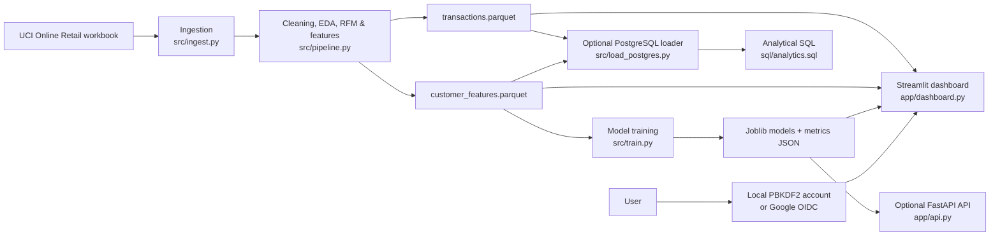
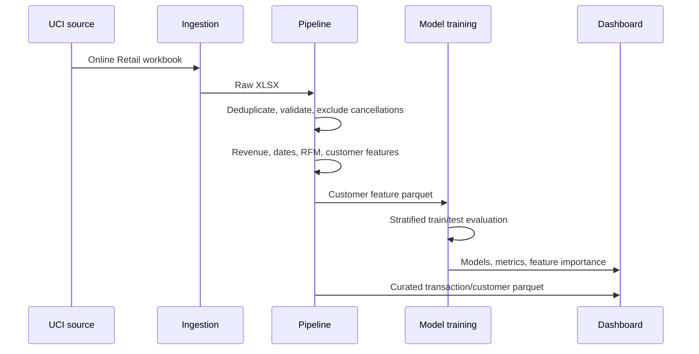
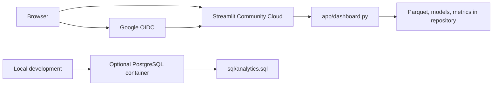

# MadeIT Insights

**Retail intelligence. Made actionable.**

[Live dashboard](https://madeit-insights.streamlit.app)

MadeIT Insights is an analytics and decision-intelligence workspace built on the public [UCI Online Retail dataset](https://archive.ics.uci.edu/dataset/352/online+retail). It turns transaction-level e-commerce data into executive KPIs, sales and product views, RFM customer segments, and repeat-purchase predictions.

## Highlights

- Analyzes **392,692 cleaned transactions**, **4,338 identified customers**, and **£8.89M** in observed revenue.
- Cleans duplicates, cancelled invoices, invalid dates, anonymous customers, and non-positive quantity/price records with pandas and NumPy.
- Builds leakage-aware customer features and RFM segments: At Risk, Potential, Loyal, and Champions.
- Evaluates Logistic Regression and Random Forest repeat-purchase models on a held-out set. Random Forest: **F1 0.6882**, **ROC-AUC 0.7285**.
- Provides a Streamlit dashboard, PostgreSQL loader/SQL queries, optional FastAPI prediction endpoint, and Google OAuth-ready authentication.

## Current dashboard

| Area | What it provides |
| --- | --- |
| Overview | Revenue, orders, active customers, average order value, and revenue trend |
| Sales | Monthly revenue and order analysis |
| Products | Revenue and unit performance by product description |
| Customers | RFM customer-segment counts, value, and observed repeat rate |
| Forecasting | Interpretable three-month moving-average baseline |
| AI Analyst | Held-out model metrics and Random Forest feature importance |

Stores, inventory, promotions, and returns are intentionally labelled as unavailable: the public source does not contain the operational dimensions needed to calculate those measures honestly.

## Architecture



### Component map

| Layer | Technology | Responsibility |
| --- | --- | --- |
| Source ingestion | Python, `urllib`, `openpyxl` | Downloads the original UCI Online Retail workbook |
| Transformation | pandas, NumPy | Validates transactions, handles duplicates/missing values, derives revenue and dates |
| Customer analytics | pandas, scikit-learn | Creates RFM scores, RFM segments, KMeans clusters, and model features |
| ML | scikit-learn, joblib | Trains/evaluates Logistic Regression and Random Forest classifiers |
| Analytics database | PostgreSQL, psycopg, SQL | Optional curated tables and reusable analytical queries |
| Dashboard | Streamlit | Authenticated executive exploration of stored data and model artifacts |
| Prediction service | FastAPI, Pydantic | Optional typed `/predict` endpoint for model serving |
| Authentication | PBKDF2 / Google OIDC | Development-local accounts and hosted Google sign-in |

### Processing sequence



### Repository layout

```text
MadeIT/
├── app/                      # Streamlit UI and optional FastAPI API
├── data/
│   ├── raw/                  # Downloaded source workbook; ignored by Git
│   └── processed/            # Curated transactions and customer features
├── models/                   # Saved classifier pipelines
├── reports/                  # Metrics and EDA outputs
├── sql/analytics.sql         # PostgreSQL analytical queries
├── src/                      # Ingestion, pipeline, training, loading, auth
├── tests/                    # Pipeline tests
├── .streamlit/               # Theme and OAuth secrets template
├── requirements.txt
└── docker-compose.yml        # Local PostgreSQL service
```

### Pipeline and model design

1. **Ingest:** download the original workbook without generating transaction data.
2. **Clean:** standardize types, parse timestamps, flag cancellations, and remove exact duplicates, invalid dates, missing customer IDs, and non-positive quantities/prices.
3. **Feature engineer:** derive revenue, calendar dates, customer RFM metrics, order value, product breadth, and customer tenure.
4. **Train:** use the earlier history window to predict activity in the final 90 days, avoiding target leakage.
5. **Evaluate:** run stratified held-out evaluation with `random_state=42`, save precision, recall, F1, ROC-AUC, average precision, and Random Forest feature importance to `reports/model_metrics.json`.

| Model | Purpose | Evaluation |
| --- | --- | --- |
| Logistic Regression | Interpretable linear baseline | Precision, recall, F1, ROC-AUC, average precision |
| Random Forest | Non-linear comparison | Same metrics plus feature importance |

## Local setup

```bash
git clone https://github.com/TusharShekhar1198/MadeIT.git
cd MadeIT
python -m venv .venv
source .venv/bin/activate       # Windows: .venv\Scripts\activate
pip install -r requirements.txt
python -m src.ingest
python -m src.pipeline
python -m src.train
streamlit run app/dashboard.py
```

Run tests with:

```bash
pytest -q
```

## PostgreSQL and API

```bash
cp .env.example .env
docker compose up -d db
python -m src.load_postgres
psql "$DATABASE_URL" -f sql/analytics.sql
uvicorn app.api:app --reload
```

`POST /predict` accepts the behavioral features used during model training and returns probabilities from both classifiers.

## Google sign-in

The dashboard supports Google OpenID Connect through Streamlit. Create a Google OAuth web client and configure the exact redirect URI for your environment.

| Environment | Redirect URI |
| --- | --- |
| Local | `http://localhost:8501/oauth2callback` |
| Hosted | `https://madeit-insights.streamlit.app/oauth2callback` |

Copy `.streamlit/secrets.toml.example` to `.streamlit/secrets.toml` locally, or paste its values into Streamlit Community Cloud **Settings → Secrets**. Never commit client secrets.

## Deployment

The dashboard is deployed from `app/dashboard.py` on Streamlit Community Cloud. The repository includes the prepared parquet files, trained models, and model metrics so the dashboard works without running the training pipeline during startup. Update `requirements.txt` and push to `main` to trigger a rebuild.

## Data and model notes

- The raw UCI workbook is not committed; run `python -m src.ingest` to retrieve it.
- The repeat-purchase label is activity in the final 90 days of the dataset; model features use the preceding history window.
- Current local email/password accounts use SQLite and are suitable for development only. Google identity is handled through Streamlit OIDC. Use managed PostgreSQL or an identity provider for durable production user/role storage.
- This project does not claim profit, store, inventory, promotion, supplier, or return metrics because the source data does not provide them.

## Deployment topology and production evolution



The deployed Streamlit dashboard is file-backed: it reads committed parquet/model artifacts at runtime. FastAPI and PostgreSQL are optional local or separately hosted services; Streamlit Community Cloud does not deploy them as independent services.

For a multi-user enterprise version, replace the SQLite development account store with managed PostgreSQL and role-based access control. Add real feeds for stores, product cost, inventory, promotions, returns, and suppliers before enabling those decision modules.
